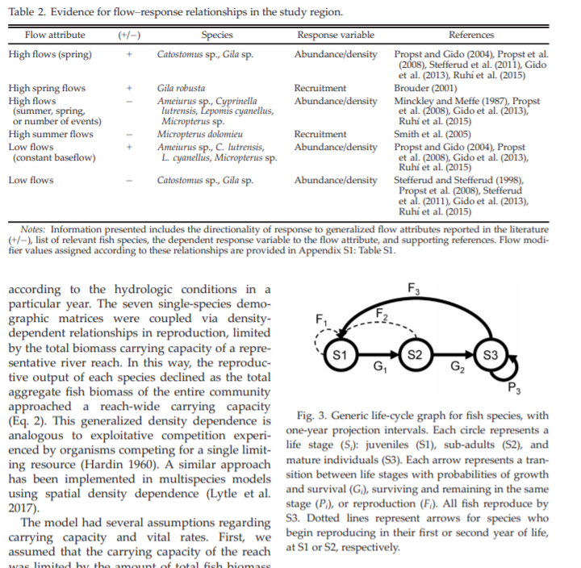
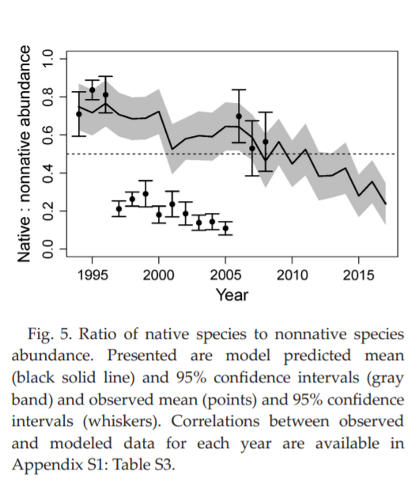
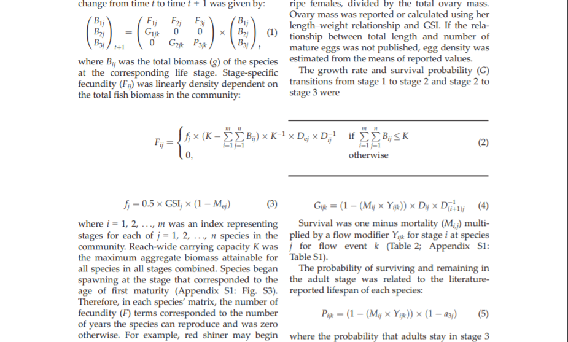

```yaml
Files: Rogosch_et_al-2019-Ecosphere-a4ad855c-1151-4db5-80bf-bec698120f77.pdf,Rogosch_et_al-2019-Ecosphere-e2e139b6-1e8c-4e13-80ed-00f183c66b97.sup-1.pdf
Authors: DAVID A LYTLE,DAVID A. LYTLE; DAVID M. MERRITT,David M Merrit, JANE S. ROGOSCH,JONATHAN D. TONKIN,JULIAN D. OLDEN,LINDSAY V. REYNOLDS
Publication date: Apr 10, 2019
Status: Scanned
Tags: Working on
Title: Increasing drought favors nonnativefishes in a dryland river:evidence from a multispecies demographic model
link: https://esajournals.onlinelibrary.wiley.com/doi/full/10.1002/ecs2.2681
notes: There is a key aspect of this paper that I think will be helpful for looking at cheetah dynamics and then future genetics associated with these dynamics.
```

# Multispecies demographic model [fish] {#intro}

### Abstract

Understanding how novel biological assemblages are structured in relation to dynamic environmental regimes remains a central challenge in ecology. Demographic approaches to modelling species assemblages show promise because they seek to represent fundamental relationships between population dynamics and environmental conditions. In dryland rivers, rapidly changing climate conditions have shifted drought and flooding regimes with implications for fish communities. Our goals were to (1) develop a mechanistic multispecies demographic model that links native and non-native species with river flow regimes, and (2) evaluate demographic responses in population and community structure to changing flow regimes. Each fish species was represented by a stage-structured matrix, and species were coupled together into a multispecies framework through density-dependent relationships in reproduction. Then, community dynamics were simulated through time using annual flow events classified from gaged streamflow data. We parameterized the model with vital rates and flow–response relationships for a community of native and non-native fishes using literature-derived values. We applied the simulation model to the Verde River (Arizona, USA), a major tributary within the Colorado River Basin, for the past half century (1964–2017). Model validation revealed a match between model projections and relative abundance trends observed in a long-term fish monitoring dataset (1994–2008). At the beginning of the validation period (1994), model and survey observations showed that native species comprised approximately 80% of total abundance. Model projections beyond the survey data (2008–2017) predicted a shift from a native dominant to a non-native dominant assemblage, coinciding with increasing drought frequency. Trade-offs between native and non-native species dominance emerged from differences in mortality in response to the changing sequence of major flow events including spring floods, summer high flows, and droughts. In conclusion, the demographic approach presented here provides a flexible modeling framework that is readily applied to other stream systems and species by adjusting or transferring, when appropriate, species vital rates and flow-event thresholds.

#### *Abstract* breakdown

Understanding how novel biological assemblages are structured in relation to dynamic environmental regimes remains a central challenge in ecology. Demographic approaches to modelling species assemblages show promise because they seek to represent fundamental relationships between population dynamics and environmental conditions. In dryland rivers, rapidly changing climate conditions have shifted drought and flooding regimes with implications for fish communities. 

Our goals were to:

(1) develop a mechanistic multispecies demographic model that links native and nonnative species with river flow regimes, and 

(2) evaluate demographic responses in population and community structure to changing flow regimes. Each fish species was represented by a stage-structured matrix, and species were coupled together into a multispecies framework through density-dependent relationships in reproduction. 

Then, community dynamics were simulated through time using annual flow events classified from gaged streamflow data. We parameterized the model with vital rates and flow–response relationships for a community of native and non-native fishes using literature-derived values. We applied the simulation model to the Verde River (Arizona, USA), a major tributary within the Colorado River Basin, for the past half century (1964–2017). Model validation revealed a match between model projections and relative abundance trends observed in a long-term fish monitoring dataset (1994–2008). 

**Later on:** *We modelled a fish community by examining species‐specific vital rates that varied as a function of flow regimes describing patterns of drought and flooding. Density‐dependent relationships coupled populations together into a multispecies framework, and community dynamics were simulated through a sequence of flow events defined by the streamflow record. We validated the model by comparing model projections to empirical data from a long‐term fish monitoring program. We then examined how contemporary climate‐driven change in the sequence of drought and flood events affects the composition of native and non-native species in the community.*

At the beginning of the validation period (1994), model and survey observations showed that native species comprised approximately 80% of total abundance. Model projections beyond the survey data (2008–2017) predicted a shift from a native dominant to a non-native dominant assemblage, coinciding with increasing drought frequency. Trade-offs between native and non-S1native species dominance emerged from differences in mortality in response to the changing sequence of major flow events including spring floods, summer high flows, and droughts. In conclusion, the demographic approach presented here provides a flexible modeling framework that is readily applied to other stream systems and species by adjusting or transferring, when appropriate, species vital rates and flow-event thresholds.

---

### Vocabulary

- validation period (1994)

    What do you think it means?

    - what it really means


# Preview

### Questions

- Life cycles used here?




### Notes and thoughts

---

Interesting figures for sure! see below...


# Intensive

### Figures and Graphs
---



The power of these models I think is the ability to simply bound population dynamics based on know life history traits as here:


$${}$$



### Questions

...


### Publication ideas

- Cheetah meta-population dynamics

### Notes and thoughts

Really only stupid broad brush ideas here for now. Add anything you like

1. Extention of the cheetah idea...


2. Invasive possum dynamics...


3. Over generic PVA analysis...


### Confusions /Problems /Difficulties

---

- How is this related to the matrix paper?